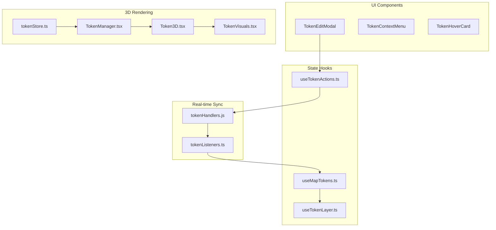
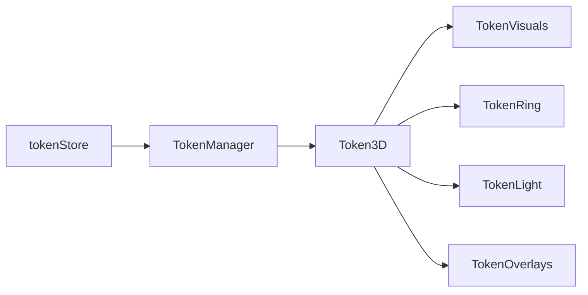

# Sistema de Tokens: Documentação Técnica Completa

Este documento detalha o **sistema completo de tokens** do QuestBinder VTT, incluindo criação/edição, gerenciamento de estado, eventos de socket, renderização 2D/3D e interações de usuário.

---

## 1. Arquitetura do Sistema



---

## 2. Arquivos do Sistema (20+)

| Camada | Arquivo | Linhas | Descrição |
| :--- | :--- | :---: | :--- |
| **UI** | `client/src/components/vtt/TokenEditModal.tsx` | 745 | Modal de criação/edição de tokens |
| **UI** | `client/src/components/vtt/TokenContextMenu.tsx` | 214 | Menu de contexto (clique direito) |
| **UI** | `client/src/components/vtt/TokenHoverCard.tsx` | 479 | Card de hover com HP, condições, rolls |
| **UI** | `client/src/components/vtt/TokenSettings/AuraSettingsPanel.tsx` | 482 | Painel de configuração de auras |
| **Hooks** | `client/src/context/gameSession/hooks/useTokenActions.ts` | 336 | CRUD de tokens, movimento, seleção |
| **Hooks** | `client/src/components/vtt/map/hooks/useMapTokens.ts` | 197 | Drag & Drop com pathfinding |
| **Hooks** | `client/src/components/vtt/map/hooks/useTokenLayer.ts` | 58 | Animações de movimento 2D |
| **Socket** | `server/socket/handlers/tokenHandlers.js` | 145 | Handlers do servidor (add/update/remove) |
| **Socket** | `client/src/context/gameSession/hooks/listeners/tokenListeners.ts` | 101 | Listeners do cliente (state sync) |
| **3D** | `client/src/modules/vtt/map3d/entities/tokens/Token3D.tsx` | 84 | Componente 3D principal |
| **3D** | `client/src/modules/vtt/map3d/entities/tokens/TokenManager.tsx` | 28 | Gerenciador de todos tokens 3D |
| **3D** | `client/src/modules/vtt/map3d/store/tokenStore.ts` | 47 | Zustand store para 3D |
| **Types** | `client/src/types/models.ts` | 754 | Tipos Token, Aura, CombatEffect |

---

## 3. Hook: useTokenActions

Gerencia todas as operações CRUD de tokens:

```typescript
// Retorno do hook
{
  moveToken: (id, x, y) => void;      // Move token no grid
  moveTokens: (updates[]) => void;    // Move múltiplos tokens
  updateToken: (id, data) => void;    // Atualiza propriedades
  addToken: (tokenData) => void;      // Cria novo token
  removeToken: (id) => void;          // Remove token
  moveTokenToScene: (id, sceneId) => void; // Mover entre cenas
  selectToken: (id, multi) => void;   // Selecionar token
  clearSelection: () => void;         // Limpar seleção
  emitTokenDrag: (id, x, y, path) => void; // Emitir drag em tempo real
  emitCursorMove: (x, y) => void;     // Cursor throttled
}
```

**Validação de Permissões** (REGRA MILENAR):
- `permissionHelper.canMoveToken(token)`
- `permissionHelper.canEditToken(token)`
- `permissionHelper.canDeleteToken(token)`
- `permissionHelper.can('tokenCreate')`

---

## 4. Eventos de Socket

### Servidor (`tokenHandlers.js`)

| Evento | Payload | Validação | Descrição |
| :--- | :--- | :--- | :--- |
| `token:add` | `{ sceneId, token }` | `can('tokenCreate')` | Cria token |
| `token:update` | `{ sceneId, id, changes }` | `canMoveToken` ou `canEditToken` | Atualiza token |
| `token:remove` | `{ sceneId, id }` | `canDeleteToken` | Remove token |

### Cliente (`tokenListeners.ts`)

| Listener | Ação no State |
| :--- | :--- |
| `token:update` | `StateHelpers.updateItemInSceneList()` |
| `token:add` | `StateHelpers.addItemToSceneList()` |
| `token:remove` | `StateHelpers.removeItemFromSceneList()` |
| `token:drag` | Atualiza `remoteDrags` (preview visual) |

---

## 5. Hook: useMapTokens (Drag & Drop)

Gerencia interação de arrastar tokens no mapa 2D:

```typescript
{
  findTokenAt: (worldX, worldY) => Token | null;
  handleTokenDragStart: (e, token, worldPos, screenPos) => void;
  handleTokenDragMove: (worldPos) => void;
  handleTokenDragEnd: (calculatedPath) => void;
}
```

**Pathfinding Debounced**: Recalcula caminho a cada 50ms max usando `findPath()`.

---

## 6. TokenContextMenu (Clique Direito)

### Props
```typescript
{
  x: number; y: number;       // Posição do menu
  token: Token;               // Token selecionado
  onEdit, onDuplicate, onDelete, onToggleVisibility;
  onToggleCondition: (condition) => void;
  onOpenSheet?: () => void;   // Abrir ficha vinculada
}
```

### Ações Disponíveis
| Ação | Permissão | Descrição |
| :--- | :--- | :--- |
| Abrir Ficha | linkedId | Abre ficha do personagem |
| Linkar no Chat | Todos | Envia link do token no chat |
| Editar | `canEditToken` | Abre TokenEditModal |
| Duplicar | `tokenCreate` | Cria cópia do token |
| Visibilidade | `canEditToken` | Oculto/Visível |
| Enviar para Cena | GM Only | Move para outra cena |
| Remover | `canDeleteToken` | Deleta token |

---

## 7. TokenHoverCard (Hover)

Exibe informações detalhadas ao passar o mouse:

### Seções Condicionais
| Seção | Condição | Controles |
| :--- | :--- | :--- |
| **HP Bar** | `showHP` + (visible ou GM) | +1, +5, -1, -5 |
| **Resource Bar** | `showResource` | +1, -1 |
| **Conditions** | `showConditions` | Click: compartilhar, RightClick: remover |
| **Stats (AC/Speed)** | `showStats` | Readonly |
| **Attributes** | `showAttributes` + canControl | Rolagem rápida de teste |

### Permissões de Hover (`TokenHoverPermissions`)
```typescript
{
  enabled: boolean;           // Master toggle
  pc: { showName, showHP, showResource, showConditions, showStats, showAttributes };
  npc: { showName, showHP, showResource, showConditions, showStats, showAttributes };
  object: { showName, showConditions };
}
```

---

## 8. Sistema 3D (Three.js + React Three Fiber)

### Arquitetura 3D



### Token3D Component
```typescript
// Hooks usados
useTokenState(token)      // Calcula position no mundo
useTokenDrag(id, pos)     // Drag interativo
useTokenSelection(id)     // Estado de seleção

// Sub-componentes
<TokenVisuals />          // Geometria e textura do token
<TokenRing />             // Anel de seleção
<TokenLight />            // Emissor de luz 3D
<TokenOverlays />         // Auras, condições, HP bar 3D
```

### tokenStore (Zustand)
```typescript
{
  tokens: Record<string, Token>;
  addToken, removeToken, updateToken, setTokens;
}
```

---

## 9. useTokenLayer (Animações 2D)

Gerencia animações suaves de movimento:

```typescript
interface TokenAnimation {
  id: string;
  startX, startY: number;
  targetX, targetY: number;
  startTime: number;
  duration: number;         // Calculado: min(500, 150 + dist * 30)
}
```

---

## 10. Tipos Principais

### Token
```typescript
interface Token {
  id: string;
  type: 'pc' | 'npc' | 'object';
  name: string;
  x: number; y: number;
  size: number;
  imgUrl: string;
  rotation?: number;
  isVisibleToPlayers: boolean;
  ownerId?: string;
  controlledBy?: string[];
  linkedId?: string;
  bars?: { bar1?, bar2? };
  conditions?: Condition[];
  visionRange?, darkvisionRange?, visionColor?;
  light?: LightConfig;
  auras?: Aura[];
  effects?: CombatEffect[];
  ignoredAuras?: string[];
  disposition?: 'friendly' | 'neutral' | 'hostile';
  shape?: TokenShape;
  scale?: number;
  border?: { color, width, style };
  tint?: string;
  idleAnimation?, effect?;
  imageX?, imageY?, imageRotation?;
  stats?: TokenStats;
  displayMode?: 'image' | 'text';
  textDetails?: { text, backgroundColor, textColor };
  speed?: number;
}
```

### Aura
```typescript
interface Aura {
  id, name: string;
  radius: number;
  color: string;
  shape: 'circle' | 'square';
  effects: CombatEffect[];
  targets: 'all' | 'allies' | 'enemies' | 'self';
  active: boolean;
  visible?: boolean;
  includedTokenIds?, excludedTokenIds?: string[];
  description?, category?, trigger?, requirements?;
}
```

### CombatEffect
```typescript
interface CombatEffect {
  id, name: string;
  description?, icon?, color?;
  duration: { type, value, remaining };
  source?, sourceAuraId?;
  conditions?: CombatCondition[];
  modifiers?: { ac?, speed?, advantage?, disadvantage? };
}
```

### TokenStats (Mini-Ficha NPC)
```typescript
interface TokenStats {
  ac: number;
  hpFormula?: string;
  speed: string;
  attributes: Attributes;
  alignment?: string;
  type?: string;
  cr?: string;
  senses?: string;
  languages?: string;
  notes?: string;
}
```

---

## 11. TokenEditModal: Variáveis de Estado (40+)

### Identidade
| Estado | Tipo | Default |
| :--- | :--- | :--- |
| `tokenType` | `'pc' \| 'npc' \| 'object'` | `'npc'` |
| `linkedId` | `string` | `''` |
| `controlledBy` | `string[]` | `[]` |
| `name` | `string` | `'Novo Token'` |
| `displayMode` | `'image' \| 'text'` | `'image'` |

### Física
| Estado | Tipo | Default |
| :--- | :--- | :--- |
| `size` | `number` | `1` |
| `speed` | `number` | `9` |
| `isVisible` | `boolean` | `true` |
| `rotation` | `number` | `0` |

### Estilo Visual
| Estado | Tipo | Default |
| :--- | :--- | :--- |
| `shape` | `TokenShape` | `'circle'` |
| `scale` | `number` | `1` |
| `borderColor`, `borderWidth`, `borderStyle` | ... | ... |
| `tintColor`, `tintAlpha` | ... | ... |
| `idleAnimation`, `effect` | ... | ... |

### Visão e Luz
| Estado | Tipo | Default |
| :--- | :--- | :--- |
| `visionRange`, `darkvisionRange` | `number` | `0` |
| `lightEnabled` | `boolean` | `false` |
| `lightBright`, `lightDim` | `number` | ... |
| `lightColor`, `lightAnim` | ... | ... |

### Status
| Estado | Tipo | Default |
| :--- | :--- | :--- |
| `hpValue`, `hpMax`, `hpVisible` | `number/boolean` | ... |
| `mpValue`, `mpMax`, `mpVisible` | `number/boolean` | ... |
| `conditions` | `Condition[]` | `[]` |
| `auras` | `Aura[]` | `[]` |

---

## 12. Condições do Sistema (17)

```
dead, bloodied, stunned, shielded, alert, frightened, grappled, prone,
blinded, charmed, poisoned, restrained, incapacitated, unconscious,
invisible, paralyzed, petrified, deafened, exhausted
```

Definidas em `client/src/data/rules.ts` com `STATUS_RULES`.

---

## 13. Presets de Objetos (7)

| ID | Label | Luz | Efeito | Animação |
| :--- | :--- | :---: | :---: | :---: |
| `torch` | Tocha | 6/12m | burning | breath |
| `lantern` | Lanterna | 9/18m | none | none |
| `campfire` | Fogueira | 4/9m | burning | breath |
| `magic_orb` | Orbe | 3/6m | outline | float |
| `chest` | Baú | ❌ | none | none |
| `door` | Porta | ❌ | none | none |
| `trap` | Armadilha | ❌ | none | none |

---

## 14. Fluxo de Criação de Token

1. **Usuário** clica em "Novo Token" ou arrasta do bestiário.
2. **TokenEditModal** abre com estado inicial.
3. **Usuário** preenche dados (tipo, nome, imagem, stats).
4. **Usuário** clica em "Salvar".
5. `getData()` coleta todos os estados em `TokenData`.
6. `onSave(data, position)` é chamado.
7. `addToken()` via `useTokenActions`.
8. **Socket** `token:add` emitido.
9. **Servidor** valida permissões, persiste no DB.
10. **Servidor** broadcast `token:add` para todos clientes.
11. **Listeners** atualizam estado local.
12. **Token** renderizado no mapa.

---

## 15. Permissões de Token

| Permissão | Descrição |
| :--- | :--- |
| `tokenMovement` | Mover tokens próprios ou controlados |
| `tokenCreate` | Criar novos tokens |
| `tokenEdit` | Editar tokens próprios ou controlados |
| `tokenDelete` | Deletar tokens próprios ou controlados |

**Hierarchy de Controle**:
1. GM tem acesso total.
2. Owner (`ownerId`) tem acesso total ao seu token.
3. Controllers (`controlledBy[]`) têm acesso de movimento e edição.
4. Outros jogadores precisam de permissões globais.

---

## 16. Sistema de Abas (TokenEditModal)

| Aba | PC | NPC | Object | Descrição |
| :---: | :---: | :---: | :---: | :--- |
| `general` | ✅ | ✅ | ✅ | Nome, Tamanho, Movimento, Visão. |
| `sheet` | ❌ | ✅ | ❌ | Mini-ficha do monstro (atributos, ações). |
| `style` | ✅ | ✅ | ✅ | Forma, Borda, Ajuste de Imagem, Efeitos. |
| `stats` | ✅ | ✅ | ❌ | Barras de HP/Recurso, Condições, Efeitos. |
| `light` | ✅ | ✅ | ✅ | Configurações de emissor de luz. |
| `auras` | ✅ | ✅ | ✅ | Painel de Auras (AuraSettingsPanel). |
| `perms` | ✅ | ✅ | ❌ | Controladores (permissões por jogador). |
